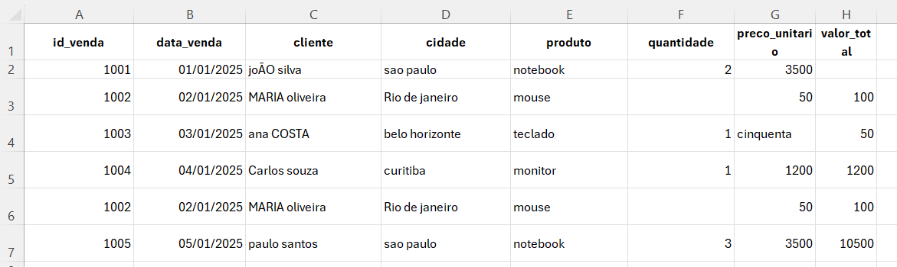

# Projeto de Limpeza e Padronização de Dados de Vendas 📊

## 📌 Contexto
Este projeto demonstra o tratamento de uma base de dados de vendas que apresentava diversas inconsistências, impossibilitando uma análise precisa.

## 🛠️ Problemas Identificados (O "Antes")
A base original possuía os seguintes erros:
- **Inconsistência de Case**: Nomes de clientes e cidades misturando maiúsculas e minúsculas (ex: `joÃO silva`).
- **Dados Faltantes**: Colunas de `quantidade` e `valor_total` vazias em algumas linhas.
- **Erros de Tipagem**: Valores numéricos escritos por extenso (ex: `cinquenta` em vez de `50`).
- **Duplicidade**: O ID 1002 estava duplicado na base original.

## 🧹 Transformações Realizadas (O "Depois")
1. **Padronização de Texto**: Aplicação da função `MAIÚSCULA` para uniformizar nomes e cidades.
2. **Correção de Dados**: Substituição de termos por extenso por valores numéricos.
3. **Cálculos Automáticos**: Implementação da fórmula `=[@QUANTIDADE]*[@PREÇO]` para garantir que o total esteja sempre correto.
4. **Remoção de Duplicados**: Limpeza de entradas repetidas para integridade dos IDs.
5. **Formatação Visual**: Aplicação de estilos de tabela e moeda (R$) para facilitar a leitura.

## 📊 Comparativo Visual
| Antes (Dados Brutos) | Depois (Dados Tratados) |
| :---: | :---: |
|  |  |

## 📁 Tecnologias
- Microsoft Excel (Fórmulas, Formatação de Tabela e Limpeza de Dados).
